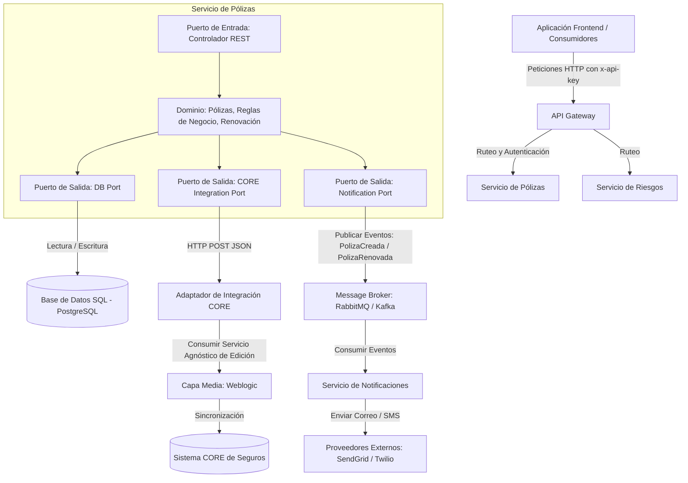
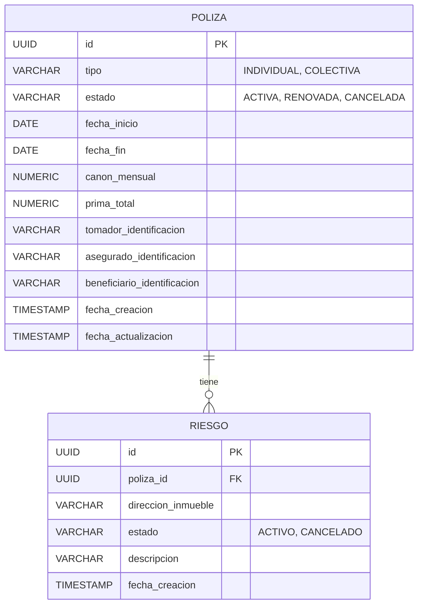

# Documentación de Respuestas – Prueba Técnica Desarrollador TI / Sénior

**Candidato:** Juan Andres Morales
**GitHub:** [https://github.com/Primooo326/prueba-tecnica-davivienda.git](https://github.com/Primooo326/prueba-tecnica-davivienda.git)

**Candidato:** Juan Andres Morales
**GitHub:** [https://github.com/Primooo326/prueba-tecnica-davivienda.git](https://github.com/Primooo326/prueba-tecnica-davivienda.git)

Este documento contiene la resolución de los módulos teóricos y de diseño de la prueba técnica.

---

## MÓDULO 1 – Diseño de Sistema (System Design)

### 1. Arquitectura de Alto Nivel del Sistema

Se propone una **Arquitectura Hexagonal (Ports & Adapters)** combinada con un patrón de **API Gateway** y un enfoque **Event-Driven (Basado en Eventos)**. Esto permite desacoplar completamente la lógica de negocio (Dominio de Pólizas y Riesgos) de las interfaces de entrada (APIs) y de los sistemas legados (CORE transaccional a través del middleware Weblogic).

#### Componentes Principales e Interacciones (Diagrama)



### 2. Selección de 3 Patrones de Arquitectura y Justificación

1. **Arquitectura Hexagonal (Ports & Adapters)**
   - *Justificación*: Protege las reglas de negocio (Dominio) de cambios en la base de datos o en la tecnología de integración del CORE legado. Al definir "puertos" (interfaces), podemos cambiar el adaptador del CORE (actualmente Weblogic) por una API REST moderna, colas de mensajería o servicios gRPC sin alterar una sola línea de lógica de la póliza.
2. **Event-Driven Architecture (Arquitectura Orientada a Eventos)**
   - *Justificación*: El negocio requiere resiliencia, disponibilidad 24/7 y notificación por correo/SMS. El envío de notificaciones es una tarea de entrada/salida propensa a retrasos o fallos del proveedor. Al publicar un evento (e.g., `PolizaCreada`) en un Broker de Mensajería, desacoplamos la transacción principal de la notificación, permitiendo que el Servicio de Notificaciones reintente el envío sin afectar el flujo del usuario.
3. **API Gateway**
   - *Justificación*: Centraliza la seguridad (validación obligatoria de `x-api-key`), simplifica el ruteo hacia múltiples microservicios independientes, y maneja la tolerancia a fallos en el borde mediante límites de tasa (rate limiting) y balanceo de carga para soportar la disponibilidad 24/7.

---

### 3. Modelo de Datos Principal



#### Descripción de Entidades:
- **Póliza (`POLIZA`)**:
  - `tipo`: Enumera si es `INDIVIDUAL` o `COLECTIVA`.
  - `estado`: Controla el ciclo de vida de la póliza (`ACTIVA`, `RENOVADA`, `CANCELADA`).
  - `prima_total`: Campo calculado en el dominio (`canon_mensual` * meses de vigencia).
  - Regla de Negocio: Si `tipo` es `INDIVIDUAL`, el motor de base de datos o la capa de servicio valida que el número máximo de riesgos asociados sea 1.
- **Riesgo (`RIESGO`)**:
  - Relacionado a una póliza mediante la clave foránea `poliza_id`.
  - `estado`: Indica si el riesgo está `ACTIVO` o `CANCELADO`. Al cancelar la póliza padre, todos los riesgos asociados cambian su estado a `CANCELADO`.

---

### 4. Aspectos No Funcionales y Operacionales

- **Escalabilidad y Despliegue**:
  - **Infraestructura como Código**: Todo el aprovisionamiento de la infraestructura está automatizado en **Azure** mediante **Terraform HCL**.
  - **Horizontal**: Despliegue en **Azure Container Apps (ACA)**, configurando reglas de auto-escalado horizontal automático (nativamente soportado por KEDA) basadas en concurrencia HTTP y consumo de recursos (CPU y memoria).
  - **Base de Datos**: Implementación de réplicas de lectura (Read Replicas) en Azure SQL Database / PostgreSQL para optimizar consultas rápidas como `GET /polizas`.
- **Logs y Observabilidad**:
  - **Monitoreo APM**: Integración nativa de **Azure Application Insights** mediante el starter de OpenTelemetry (`spring-cloud-azure-starter-monitor`). Recolecta automáticamente telemetría estructurada, logs, trazas correlacionadas de punta a punta y métricas del sistema (JVM, solicitudes, latencia).
  - **Logs Centralizados**: Trazabilidad e indexación de logs unificada en un **Azure Log Analytics Workspace**.
- **Tolerancia a Fallos**:
  - **Circuit Breaker (Resilience4j)** en el adaptador que conecta con la capa media en Weblogic para evitar que caídas o latencia del CORE degraden el API de Pólizas.
  - **Dead Letter Queues (DLQ)** en el Message Broker para reintentar de manera asíncrona la sincronización de eventos fallidos hacia el CORE o el envío de correos.
- **Versionamiento de APIs**:
  - Versionamiento por URL (e.g., `/api/v1/polizas` y `/api/v2/polizas`). Esto garantiza compatibilidad hacia atrás y permite a los clientes migrar progresivamente a la nueva versión sin cortes de servicio.


---
---

## MÓDULO 3 – Conocimientos en BBDD (Optimización)

### Consulta Original Lenta:
```sql
SELECT o.order_id, o.order_date, c.customer_name, o.total_amount
FROM orders o
JOIN customers c ON o.customer_id = c.customer_id
WHERE c.country = 'México';
```

### Tres Estrategias de Optimización:

1. **Creación de Índices Orientados a la Consulta (Indexing)**
   - **Índice en Customers**: Crear un índice compuesto en la tabla `customers` que cubra las columnas de filtrado y unión:
     ```sql
     CREATE INDEX idx_customers_country_id ON customers(country, customer_id);
     ```
     Esto evita un escaneo completo de la tabla (Full Table Scan) en `customers`, permitiendo al motor de base de datos encontrar de forma inmediata solo a los clientes de 'México'.
   - **Índice en Orders**: Crear un índice en la clave foránea de la tabla `orders` para acelerar el `JOIN`:
     ```sql
     CREATE INDEX idx_orders_customer_id ON orders(customer_id);
     ```
     Este índice permite mapear eficientemente los `customer_id` filtrados con sus órdenes correspondientes en la tabla gigante de 10 millones de filas.

2. **Particionamiento de la Tabla de Órdenes (Table Partitioning)**
   - Dado que la tabla `orders` cuenta con 10 millones de registros y crecerá constantemente, se puede aplicar **Particionamiento por Lista o Hash** en `orders` usando la columna `customer_id` (o particionamiento por rango si se divide además por `order_date`).
   - Al particionar la tabla, las búsquedas solo escanearán las particiones específicas correspondientes a los clientes en cuestión, reduciendo drásticamente el espacio de búsqueda del plan de ejecución.

3. **Uso de Vistas Materializadas o Almacenamiento en Caché (Materialized Views / Caching)**
   - Si este reporte/consulta se ejecuta frecuentemente y la información histórica de órdenes no cambia constantemente de forma inmediata, se puede implementar una **Vista Materializada** que almacene el resultado pre-calculado del join para México y se refresque en horas de bajo tráfico:
     ```sql
     CREATE MATERIALIZED VIEW mv_orders_mexico AS
     SELECT o.order_id, o.order_date, c.customer_name, o.total_amount
     FROM orders o
     JOIN customers c ON o.customer_id = c.customer_id
     WHERE c.country = 'México';
     ```
   - Alternativamente, se puede implementar una capa de almacenamiento en caché en memoria (**Redis**) con un tiempo de expiración (TTL) de modo que la base de datos relacional no reciba la misma petición costosa continuamente.

---
---

## MÓDULO 4 – Conocimientos en Versionamiento

### Caso de Uso:
Estás en la rama `feature/new-login` y necesitas incorporar urgentemente un cambio crítico de seguridad que un compañero fusionó en `main`, sin traer el resto de las actualizaciones.

### Comando y Estrategia:
Se debe utilizar la estrategia **`git cherry-pick`**.

#### Pasos a Seguir:
1. Asegurarse de tener el repositorio local actualizado:
   ```bash
   git fetch origin
   ```
2. Obtener el hash identificador del commit del bugfix en `main` (por ejemplo, `a1b2c3d4`).
3. Cambiar a tu rama de trabajo si no estás en ella:
   ```bash
   git checkout feature/new-login
   ```
4. Aplicar el commit específico sobre tu rama:
   ```bash
   git cherry-pick a1b2c3d4
   ```
5. En caso de conflictos, Git detendrá la operación. Debes resolver los archivos en conflicto, marcarlos con `git add <archivo>` y continuar el proceso con:
   ```bash
   git cherry-pick --continue
   ```

#### Justificación de por qué usar `cherry-pick`:
A diferencia de `git merge main` o `git rebase main` (que integrarían todos los cambios nuevos y commits intermedios realizados por otros desarrolladores en la rama `main`), `git cherry-pick` permite **extraer y aplicar de forma aislada un único commit (el bugfix de seguridad)** sobre la rama actual. Esto mantiene limpia la rama `feature/new-login`, evitando integrar código incompleto o no probado de otras funcionalidades de `main` que no tienen relación con el Login.

---
---

## MÓDULO 5 – Evaluación de Liderazgo Técnico y Gestión

### 1. ¿Cuáles serían tus 5 prioridades en las primeras 2 semanas?
1. **Clasificación y Estabilización de Incidentes Críticos**: Analizar la causa raíz de los 10 incidentes del último mes. Resolver de inmediato los problemas más recurrentes o graves en producción para dar respiro al equipo.
2. **Establecer un Estándar de Pull Requests y Code Review**: Crear una guía rápida de revisión de código obligatoria. Nadie sube cambios a `main` sin la aprobación de al menos otro desarrollador.
3. **Plan de Acción para Deuda Técnica Crítica**: Mapear el 40% de deuda técnica en los servicios clave y priorizar la refactorización de aquellos módulos que directamente generan incidentes en producción.
4. **Mentoring y Pairing Plan para los Desarrolladores Junior**: Asignar a cada desarrollador junior un mentor senior para realizar Pair Programming en tareas complejas y revisar juntos su código, reduciendo la brecha técnica.
5. **Alineación con el Negocio y Negociación de Alcance**: Reunirse con los stakeholders de negocio para transparentar la situación técnica del sistema, acordar un MVP realista para la entrega en 3 semanas y definir un amortiguador de tiempo (buffer) para la estabilización.

### 2. ¿Cómo organizarías al equipo para mejorar velocidad y calidad?
- **Sub-células temporales de trabajo**: Dividir a los 8 desarrolladores en:
  - *Célula de Estabilización y Calidad (3 devs)*: Enfocados en resolver incidentes y reducir deuda técnica en los componentes clave.
  - *Célula de Entrega del Negocio (5 devs)*: Enfocados en la funcionalidad a entregar en 3 semanas.
- **Pair Programming Intermitente**: Emparejar a los seniors con los juniors. Esto mejora drásticamente la calidad del código inicial y acelera el aprendizaje de los juniors.
- **Implementar Integración Continua (CI)**: Configurar pruebas automatizadas que se ejecuten con cada commit y automatizar validaciones estáticas de seguridad y formato con linters.

### 3. ¿Qué métricas implementarías para evaluar el desempeño del área?
- **Métricas DORA (Velocidad y Estabilidad)**:
  - *Lead Time for Changes*: Tiempo transcurrido desde que un commit entra a la rama de desarrollo hasta que llega a producción.
  - *Deployment Frequency*: Qué tan seguido desplegamos valor de manera exitosa.
  - *Change Failure Rate*: Porcentaje de despliegues que causan fallos en producción.
  - *Mean Time to Restore (MTTR)*: Tiempo promedio que tardamos en restaurar el servicio ante un fallo.
- **Métricas de Calidad de Código**:
  - *Code Coverage*: Cobertura de pruebas unitarias (meta inicial: 70% en código nuevo).
  - *Defect Density*: Cantidad de bugs encontrados en QA vs producción por semana.

### 4. ¿Qué prácticas técnicas establecerías como obligatorias?
- **Pruebas Automatizadas (Unitarias y de Integración)**: Ninguna tarea se considera terminada (Definition of Done) si no incluye pruebas automatizadas para sus flujos principales.
- **Revisión de Código Obligatoria (Code Review Peer-to-Peer)**: Mínimo una aprobación antes de fusionar cualquier pull request a ramas protegidas.
- **Uso estricto del Linter e Integración Continua (CI)**: Los builds de CI deben fallar si se rompen estándares de codificación o si bajan los niveles de cobertura acordados.
- **Documentación Viva**: Mantener actualizados los contratos de API (Swagger/OpenAPI) y un README con las instrucciones exactas de compilación, ejecución y despliegue del proyecto.

### 5. ¿Cómo gestionarías la presión del negocio sin comprometer la calidad?
- **Traducción técnica a valor comercial**: Explicar a los stakeholders que la deuda técnica y los incidentes recurrentes destruyen la confianza del cliente y ralentizan las entregas futuras. Cada incidente en producción detiene al equipo.
- **Negociación Basada en Datos**: Presentar un desglose detallado del esfuerzo y riesgos. En lugar de decir "no se puede", proponer un alcance simplificado o MVP: *“Podemos entregar el núcleo de la funcionalidad en 3 semanas de forma segura y estable, y las características secundarias en iteraciones semanales posteriores”*.
- **Definir el "Definition of Done (DoD)"**: Firmar un acuerdo de calidad donde "terminado" signifique desarrollado, probado (unit testing) y validado en QA. Esto evita que código incompleto sea forzado a producción.
